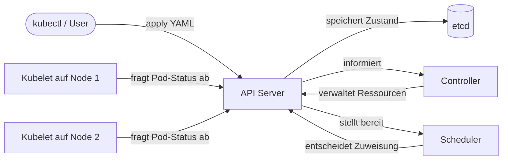

---
# You can also start simply with 'default'
theme: bricks
# random image from a curated Unsplash collection by Anthony
# like them? see https://unsplash.com/collections/94734566/slidev
background: https://cover.sli.dev
# some information about your slides (markdown enabled)
title: Welcome to Slidev
info: |
  ## Kubernetes für bridgeCon 2025
# apply unocss classes to the current slide
class: text-center
# https://sli.dev/features/drawing
drawings:
  persist: false
# slide transition: https://sli.dev/guide/animations.html#slide-transitions
transition: slide-left
# enable MDC Syntax: https://sli.dev/features/mdc
mdc: true
# open graph
# seoMeta:
#  ogImage: https://cover.sli.dev
---

# Kubernetes – Praxis für Entwickler

<!--
Willkommen! Heute geht es um Kubernetes, speziell aus der Sicht von Entwicklern.  
Ihr kennt alle Docker, deshalb steigen wir gleich in die Praxis und Use-Cases für euch ein.
-->

---

## Agenda

- Warum Kubernetes?
- Die wichtigsten Grundlagen
- Helm & Flux im Schnelldurchlauf
- Live-Demo: GitOps mit Flux **ODER** Monitoring mit Prometheus & Grafana
- Fragen & Diskussion

<!--
Kurzer Überblick über die Themen heute.  
Demo-Schwerpunkt wählen wir je nach Interesse – ich zeige gleich beide Optionen.
-->

---

# Warum Kubernetes?

- 🤖 **Automatisierung & Selbstheilung**
- 🚀 **Skalierung auf Knopfdruck**
- 🔄 **Zero-Downtime Deployments**
- 🌍 **Portabilität (Cloud, On-Prem, Hybrid)**
- 📝 **Deklarative Konfiguration (YAML)**
- 🛡️ **Rollen & Rechte (RBAC)**
- 💡 **Großes Ökosystem & Community**

<!--

- Automatisierung: Kubernetes erkennt, wenn Container oder Pods ausfallen und startet sie neu.  
- Skalierung: Ihr könnt Lastspitzen einfach abfangen, Kubernetes erstellt oder entfernt automatisch Instanzen.
- Zero-Downtime: Updates und Deployments laufen ohne Ausfälle, Rollbacks sind einfach möglich.
- Portabilität: Gleicher Stack auf Azure, AWS, GCP, on-prem oder lokal – keine Cloud-Bindung!
- Deklarativ: Infrastruktur als Code, alles nachvollziehbar und versionierbar.
- RBAC: Feingranulare Rechte, mehrere Teams können sicher im selben Cluster arbeiten.
- Ökosystem: Riesige Community, viele Tools und Tutorials – keine Insellösung!
-->

---

# Deklarative Konfiguration & Anwendung mit kubectl

- Ressourcen als YAML definieren („Infrastructure as Code“)
- Änderungen versionierbar & nachvollziehbar
- Anwendung per Befehl:  
  `kubectl apply -f <datei.yaml>`
- Cluster-Zustand wird automatisch angepasst

<!--
Bei Kubernetes beschreiben wir den Soll-Zustand unserer Infrastruktur in YAML-Dateien.  
Diese Definitionen können wir versionieren, gemeinsam pflegen und jederzeit nachvollziehen.
Mit `kubectl apply` werden diese Beschreibungen an das Cluster übertragen – Kubernetes sorgt dafür, dass der reale Zustand zum Soll-Zustand passt.
-->

---

# Die wichtigsten Ressourcen in Kubernetes

- **Pod:**  
  Kleinste deploybare Einheit, läuft ein oder mehrere Container
- **Deployment:**  
  Verwaltung und Rollout von stateless Anwendungen
- **StatefulSet:**  
  Verwaltung zustandsbehafteter Anwendungen, z.B. Datenbanken
- **Service:**  
  Stellt Netzwerkzugriff auf Pods bereit, sorgt für Load Balancing

<!-- note:
Die vier Ressourcen sind die Basis für fast alle Anwendungen in Kubernetes.
Pods enthalten die Container.
Deployments managen stateless Apps, kümmern sich um Updates/Rollbacks.
StatefulSets sind für alles zuständig, was stabilen Speicher und feste Namen braucht (z.B. Datenbanken).
Services verbinden die Pods miteinander und mit der Außenwelt.
-->

---

# Pod

```yaml
apiVersion: v1
kind: Pod
metadata:
  name: whoami-pod
spec:
  containers:
    - name: whoami
      image: docker.io/traefik/whoami
      ports:
        - containerPort: 80
```

- Enthält Container mit gemeinsamem Netzwerk und Storage
- Kurzlebig, wird meist über Deployment gemanaged

<!-- 
Pods laufen direkt im Cluster, meistens mit einem Container (manchmal mehreren, wenn diese eng zusammengehören). Sie teilen sich Netzwerk und können gemeinsam auf Volumes zugreifen. Pods sind „kurzlebig“ – wenn sie sterben, werden sie meist von Deployments neu erzeugt.
-->

---

# Deployment

```yaml
apiVersion: apps/v1
kind: Deployment
metadata:
  name: web
spec:
  replicas: 3
  selector:
    matchLabels:
      app: web
  template:
    metadata:
      labels:
        app: web
    spec:
      containers:
        - name: app
          image: docker.io/traefik/whoami
          ports:
            - name: http
              containerPort: 80
```

- Verwalten stateless Anwendungen (Webserver, API, Worker)
- Sorgt für Skalierung, Updates und Selbstheilung

<!-- 
Deployments sind der Standard für stateless Anwendungen. Sie beschreiben, wie viele Pods laufen sollen („replicas“), welches Image verwendet wird, und kümmern sich um Updates und Skalierung. Bei Fehlern sorgt das Deployment dafür, dass die gewünschte Anzahl Pods immer verfügbar ist. 
-->

---

# StatefulSet

```yaml
apiVersion: apps/v1
kind: StatefulSet
metadata:
  name: database
spec:
  serviceName: "db"
  replicas: 1
  selector:
    matchLabels:
      app: db
  template:
    metadata:
      labels:
        app: db
    spec:
      containers:
        - name: db
          image: postgres
          ports:
            - containerPort: 5432
          volumeMounts:
            - name: postgres
              mountPath: /data
          env:
          - name: POSTGRES_PASSWORD
            value: admin
  volumeClaimTemplates:
  - metadata:
      name: postgres
    spec:
      accessModes: ["ReadWriteOnce"]
      resources:
        requests:
          storage: 2Gi
```

- Für zustandsbehaftete Anwendungen (z.B. Datenbanken)
- Erhält feste Namen & stabilen Speicher für jeden Pod

<!-- 
StatefulSets sind für Anwendungen gedacht, die stabilen Speicher und eine feste Identität pro Instanz brauchen – z.B. Datenbanken oder Message Queues. Jeder Pod bekommt einen stabilen Namen und ein eigenes Volume. Updates und Rollouts erfolgen hier geordnet (nacheinander).
-->

---

# Service

```yaml
apiVersion: v1
kind: Service
metadata:
  name: web
spec:
  selector:
    app: web
  ports:
    - protocol: TCP
      port: 80
      targetPort: http
  type: LoadBalancer
```

- Macht Pods im Cluster auffindbar und erreichbar
- Verschiedene Typen: ClusterIP, NodePort, LoadBalancer

<!-- 
Services sorgen dafür, dass Pods im Cluster oder von außen erreichbar sind. ClusterIP ist nur intern sichtbar, NodePort öffnet einen Port auf jedem Node, LoadBalancer nutzt Cloud-Loadbalancer. Der Service findet automatisch alle passenden Pods über das Label-Selector-Prinzip.
-->

---

# Unterstützende Ressourcen: ConfigMap

```yaml
apiVersion: v1
kind: ConfigMap
metadata:
  name: example-config
data:
  APP_ENV: production
  LOG_LEVEL: debug
```

- Speichert Konfiguration als Key/Value-Paare
- Trennung von Code und Konfiguration
- Kann als Umgebungsvariable oder Datei im Pod verwendet werden

<!-- 
Mit ConfigMaps werden Umgebungsvariablen, Konfigurationsdateien usw. verwaltet. Der Code bleibt unverändert, die Konfiguration kann unabhängig davon angepasst werden. Im Pod können ConfigMaps als Umgebungsvariable oder als Datei gemountet werden.
-->

---

# Unterstützende Ressourcen: Secret

```yaml
apiVersion: v1
kind: Secret
metadata:
  name: example-secret
type: Opaque
data:
  DB_PASSWORD: cGFzc3dvcmQ=    # Base64-encoded!
```

- Für vertrauliche Daten (z.B. Passwörter, Tokens, Zertifikate)
- Werte sind Base64-codiert gespeichert
- Können als Umgebungsvariable oder Datei bereitgestellt werden

<!-- 
Secrets werden ähnlich wie ConfigMaps benutzt, aber für sensible Daten wie Passwörter und API-Tokens. Die Werte sind Base64-codiert (nicht verschlüsselt, aber nicht im Klartext). Secrets können Pods als Umgebungsvariable oder als Datei zur Verfügung gestellt werden.
-->

---

# Unterstützende Ressourcen: Volume & PersistentVolumeClaim

```yaml
apiVersion: v1
kind: PersistentVolumeClaim
metadata:
  name: example-pvc
spec:
  accessModes:
    - ReadWriteOnce
  resources:
    requests:
      storage: 1Gi
---
apiVersion: v1
kind: Pod
metadata:
  name: pod-with-volume
spec:
  containers:
    - name: app
      image: docker.io/traefik/whoami
      volumeMounts:
        - mountPath: "/data"
          name: my-storage
  volumes:
    - name: my-storage
      persistentVolumeClaim:
        claimName: example-pvc
```

- Volumes: Speicher für Pods (z.B. für Logs oder Uploads)
- PersistentVolumeClaim (PVC): Fordert persistenten Speicher an
- Speicher bleibt über Pod-Neustarts erhalten

<!-- 
Volumes sind notwendig, wenn Anwendungen im Container Daten dauerhaft speichern sollen. Mit einem PersistentVolumeClaim fordere ich Speicher vom Cluster an, z.B. für eine Datenbank oder Datei-Uploads. Im Pod wird das Volume eingebunden, sodass Container darauf zugreifen können – auch nach einem Pod-Restart bleibt der Speicher erhalten. 
-->

---

# Ende

---

# für Besserwisser Nachfragen

---

# Wie funktioniert das Anwenden von Ressourcen in Kubernetes?

- Ressourcen werden als YAML (oder JSON) an die Kubernetes API gesendet (z.B. via `kubectl apply`)
- Die Kubernetes API speichert alle Ressourcen im **etcd**-Cluster (Zustandsdatenbank)
- **Controller** überwachen kontinuierlich den „Soll-Zustand“ (aus YAML) und den „Ist-Zustand“ (laufende Pods etc.)

<!--
Kubernetes ist komplett API-gesteuert.  
Alles – Pods, Deployments, Services usw. – werden als Ressourcen an die API übermittelt.  
Die API speichert den gewünschten Zustand (Soll-Zustand) zentral ab.  
Controller (z.B. Deployment Controller, ReplicaSet Controller) beobachten ständig, ob der Ist-Zustand im Cluster mit dem Soll-Zustand übereinstimmt.  
Wenn etwas abweicht (z.B. ein Pod ist abgestürzt), steuern die Controller gegen (z.B. neuer Pod wird gestartet).
-->

---

# Kubernetes Architektur



- API-Server: Drehscheibe für alle Komponenten
- Scheduler: Entscheidet, welcher Pod auf welchem Node läuft
- Kubelet: Fragt den API Server ab und startet die Container

<!-- 
Wichtig: Der API Server kommuniziert nicht direkt mit den Nodes!
Die Kubelets auf den Nodes „pullen“ regelmäßig den API Server, um neue Aufgaben (Pods) zu bekommen.
Der Scheduler ist derjenige, der Pods bestimmten Nodes zuweist.
Controller sorgen dafür, dass alles im Soll-Zustand bleibt (z.B. ReplicaSet Controller sorgt für richtige Anzahl Pods).
-->